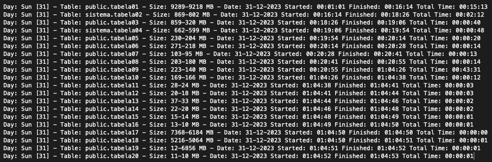

= PostgreSQL - Rotina para execução de Full Vacuum

==== O próposito deste script é executar uma rotina mensal de _"Full Vacuum"_ no Banco de Dados no último domingo do mês.

Uma rotina de _"Vacuum"_ consiste em recuperar o armazenamento ocupado por "tuplas" mortas.

Na operação normal do PostgreSQL, as "tuplas" excluídas ou obsoletas por uma atualização não são removidas fisicamente de sua tabela, elas permanecem presentes até que um _"Vacuum"_ seja executado.

Portanto é necessário fazer _"Vacuum"_ periodicamente, especialmente em tabelas atualizadas com frequência.

==== O tipo de _"Vacuum"_ abordado será o _"FULL"_

Este método requer espaço extra em disco, pois grava uma nova cópia da tabela e não libera a cópia antiga até que a operação seja concluída. Normalmente, isso só deve ser usado quando uma quantidade significativa de espaço precisa ser recuperada de dentro da tabela. Este modo, aplica _"lock"_ exclusivo então fique atento.

==== Para mais informações, visite a domentação oficial do PostgreSQL

:hide-uri-scheme: 

https://www.postgresql.org/docs/current/sql-vacuum.html

* Pré Requisitos

** Configurar as variáveis abaixo com seus respectivos valores no arquivo .bashrc (pode ser configurado em outro arquivo, desde que informado dentro do script) do usuário que for executar.

*** export vDBHost=[IP do Servidor] 
*** export vDBUser=[Nome do Usuário]
*** export vDBNome=[Nome Banco de Dados]
*** export vDBSenha=[Senha do Usuário]

** Configuração do script no crontab do Sistema

*** Sugestão: O script será executado sempre no minuto 1 da hora 1, porém, se não for o último domingo do mês nada acontecerá.

*** 01 01 * * * /path/do/script/full_vacuum_v1.sh >/dev/null 2>&1 

* Código do Script

.Standard include
[source,shell]
----
#!/usr/bin/env bash
#######################################################################################################################################
# Programa .....: full_vacuum_v1.sh
# Autor ........: Cleiton Maia (cleiton.maia@gmail.com)
# Data Criação .: 31/08/2023
# Atualização ..:
# Descrição ....: Executar a rotina de VACUUM FULL nas 20 maiores tabelas do banco de dados, as tabelas são elencadas automaticamente
#######################################################################################################################################

#---[ Environment Variables ]
clear
set +x
source /root/.bashrc
logDirectory="/var/tmp"
logFile=$(basename -s .sh "$0").log
logDate=$(TZ=":America/Fortaleza" date +%d-%m-%Y)
dayWeekName=$(TZ=":America/Fortaleza" date +%a)  # |Seg |Ter |Qua |Qui |Sex |Sab |Dom
totalLines=$(wc -l < "$logDirectory/$logFile")
currentDay=$(date +%e)
lastSun=$(date -d "-$(date +%d) days +1 month -$(date +%w) days" +'%d')
appVersion=2.0.4
appName=$(basename "$0")
export PGPASSWORD=$vDBSenha
export TERM=xterm

#---[ System Function ]
functionBanner() {
  echo   ""
  echo   "╔════════════════════════════════════════════════════════════════════════════════════════════════════════════════════════╗"
  echo   "║                                                                                                                        ║"
  printf "║$(tput bold) %-118s $(tput sgr0)║\n" "$@"
  echo   "║                                                                                                                        ║"
  echo   "╚════════════════════════════════════════════════════════════════════════════════════════════════════════════════════════╝"
  echo ""
}

#---[ Log control and Validations ]
[[ ! -f "$logDirectory/$logFile" ]] &&  > "$logDirectory/$logFile"

[[ "$totalLines" -ge 500 ]] && sed -i "$logDirectory/$logFile" -e '1,100d'

#---[ Start Procedure ]
if [ $lastSun -eq $currentDay ]; then
  # Generate List Tables
  psql -h "$vDBHost" -U "$vDBUser"  -d "$vDBNome" -t -A -c "SELECT esquema || '.' || tabela tabela FROM (SELECT tablename AS tabela, schemaname AS esquema, schemaname||'.'||tablename AS esq_tab FROM pg_catalog.pg_tables WHERE schemaname NOT IN ('pg_catalog', 'information_schema', 'pg_toast') ) AS x ORDER BY pg_total_relation_size(esq_tab) DESC LIMIT 20;" > $logDirectory/listtables.dat
  while read idTable; do
    if [ -n "$idTable" ]; then
      clear
      initialTime=$(TZ=":America/Fortaleza" date +%T)
      functionBanner ">>>>> Starting process VACUUM FULL <<<<<" \
                     ""                                         \
                     "Database Name ..: $vDBNome"               \
                     "Table Name .....: $idTable"
      initialTimeSum=$(TZ=":America/Fortaleza" date  +%s)
      sizeBefore=$(psql -h "$vDBHost" -U "$vDBUser"  -d "$vDBNome" -t -c "\dt+ $idTable" | awk '{print $9}')
      psql -h "$vDBHost" -U "$vDBUser"  -d "$vDBNome" -c "VACUUM (FULL, VERBOSE, ANALYZE, TRUNCATE) $idTable ; "
      sizeAfter=$(psql -h "$vDBHost" -U "$vDBUser"  -d "$vDBNome" -t -c "\dt+ $idTable" | awk '{print $9}')
      finishTime=$(TZ=":America/Fortaleza" date +%T)
      finalTimeSum=$(TZ=":America/Fortaleza" date  +%s) # Captura o segundo TimeStamp
      totalRecordSum=$(( finalTimeSum - initialTimeSum )) # Diferenca entre os TimeStamps
      totalTime=$(date -d @$totalRecordSum +%H:%M:%S)
      echo "Day: $dayWeekName [$currentDay] - Table: $idTable - Size: $sizeBefore-$sizeAfter MB - Date: $logDate Started: $initialTime Finished: $finishTime Total Time: $totalTime" >> "$logDirectory/$logFile"
    fi
  done < $logDirectory/listtables.dat
fi

----

** Quando executado, será gravado um arquivo de log em /var/tmp/full_vacuum_v1.log com informações sobre as tabelas afetadas.

*** Saída do log

